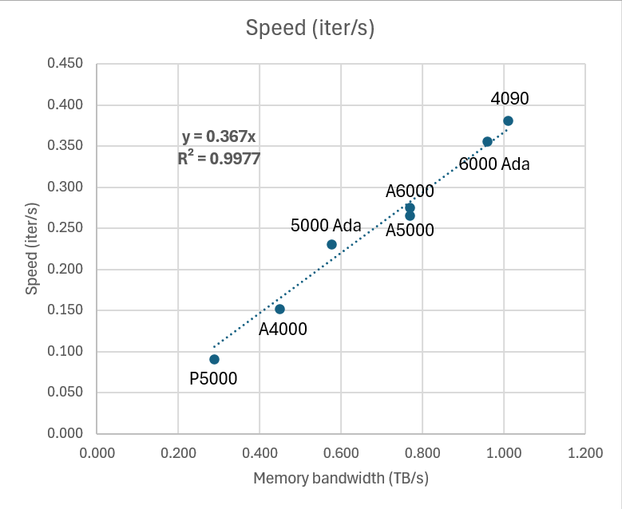

# Notes of choosing GPU for ptychography

1. Ptycho throughput (sec/iter) seems to correlate with *GPU memory bandwidth* better than the *TFlops* for a wide range of GPUs (see `GPU_comparison.xlsx`) given my reconstruction task (16384 DPs, 1 slice, 12 probes, batch size 256 as `params/paper/ptyrad_tBL-WSe2_speed.yml`)

2. The theoretical TFlops can be very confusing due to different data types (FP32, TF32, INT8), but for ptycho reconstruction it seems like FP32 is the most relevant datatype
3. Modern GPUs are speciallized for ML applications with specific data types like FP16, bf16, or INT8, or even INT4 for LLM purposes
4. [*`TF32` is only enabled on tensor cores (i.e., for certain GPUs with Ampere or Hopper architechture like A100 or H100) for convolution and matrix multiplication*, and only for certain framework](https://www.digitalocean.com/community/tutorials/understanding-tensor-cores), so the tensor cores are probably irrelevant for most ptycho reconstruction packages because it's mostly element-wise multiplication and Fourier transform. 
5. [Some references mentioned A100 can be even faster if the matrix has some structured sparsity](https://developer.nvidia.com/blog/structured-sparsity-in-the-nvidia-ampere-architecture-and-applications-in-search-engines/), that is also not relevant for ptycho purpose because (1) we don't do matrix multiplication and (2) we don't typically have sparse matrices that fullfill the requirement for such additional acceleration
6. [`nvidia-smi` is a command line tool that only shows the time-occupancy](https://arthurchiao.art/blog/understanding-gpu-performance/#1-nvidia-gpu-util-a-confusing-phenomenon), so the GPU and memory utilization doesn't necessarily mean the saturation or the "utilizaiton" in common sense. Besides, `nvidia-smi` doesn't work for MIG slices so we can't really check the utilization on most of our Altas GPU nodes.
7. While `nvidia-smi` might not be that ideal, it did suggest a 80GB A100 and 92 GB H100 are not as utilized as other GPUs (~ 75-80% GPU memory utilization on my ptycho task), suggesting we're not yet fully saturating these monster data center cards for my benchmark ptycho task
8. Consumer cards (RTX 4090) could be much cheaper options comparing to data center cards (A100) if you're looking for fast reconstruction and your 4D dataset can fit into your GPU VRAM with the chosen batch size, although you should take the life expectancy into account
9. In practice, CPU and intercommunication can still play a significant role so the performance could be suboptimal if your system / task is CPU-bottlenecking. I did my GPU tests on rented GPUs on vast.ai and they all have different CPUs.

Chia-Hao Lee, cl2696@cornell.edu
Last update: 2024.12.19